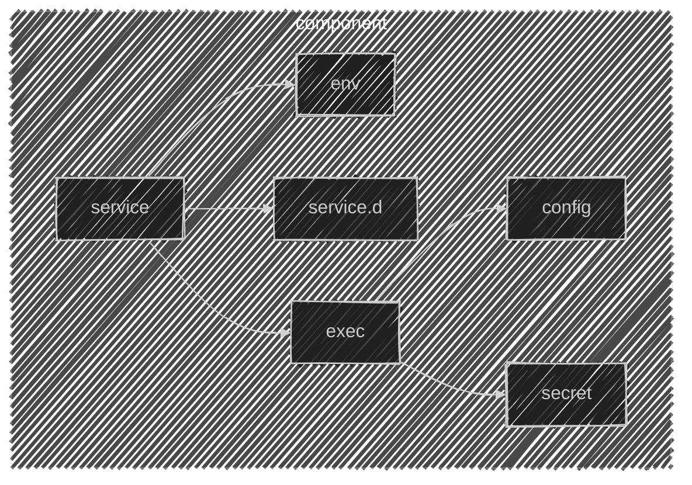

import CRISetup               from '@site/docs/tech-docs/kubernetes/components/cri/main.mdx'
import ETCDSetup              from '@site/docs/tech-docs/kubernetes/components/etcd/staticPod.mdx'
import ControllerManagerSetup from '@site/docs/tech-docs/kubernetes/components/controllerManager/staticPod.mdx'
import SchedulerSetup         from '@site/docs/tech-docs/kubernetes/components/scheduler/staticPod.mdx'
import KubeAPISetup           from '@site/docs/tech-docs/kubernetes/components/kubeAPI/staticPod.mdx'
import KubeletSetup           from '@site/docs/tech-docs/kubernetes/components/kubelet/main.mdx'
import { FancyboxDiagram }    from '@site/src/components/commonBlocks/FancyboxDiagram'
import { CUSTOM_VALUE }       from '@site/src/constants/kubernetes/customValue'
import CodeBlock              from '@theme/CodeBlock'
import {ETCD_ARGS}            from '@site/src/constants/kubernetes/etcdArgs'
import {KUBE_API_ARGS}        from '@site/src/constants/kubernetes/kubeAPIArgs'
import TabItem                from '@theme/TabItem'
import Tabs                   from '@theme/Tabs'

import KubeadmInitConfig      from '@site/docs/tech-docs/kubernetes/components/kubeadm/initConfig.mdx'
import KubeadmJoinConfig      from '@site/docs/tech-docs/kubernetes/components/kubeadm/joinConfig.mdx'


#### Каждый компоненты мы представляем как набор сущностей:
1. `service`: Systemd unit, ориентированный на запуск сценария при старте ОС.
2. `service.d`: Конфигурационные файлы Systemd unit.
3. `env`: Переменные окружения программы.
4. `exec`: Исполняемый файл программы
5. `config`: Конфигурационный файл программы
6. `secret`: Ключ доступа программы к интеграционному узлу.

<div className="center">
  <FancyboxDiagram>

   </FancyboxDiagram>
</div>


### Настройка Services
<CRISetup />
<KubeletSetup />

<Tabs groupId="current-master">
  <TabItem value='master-1'>

    <Tabs groupId="install-type">

      <TabItem value='HardWay'>
        :::warning
        Чтобы проверить правильность установки всех базовых компонентов, выполните команду:

        ```bash
        kubeadm init phase preflight \
          --dry-run
        ```
        Если все установлено корректно, команда выполнится без ошибок, и вы увидите следующий вывод:
        ```bash
        [preflight] Running pre-flight checks
        [preflight] Would pull the required images (like 'kubeadm config images pull')
        ```
        :::
      </TabItem>

      <TabItem value='Kubeadm'>
        <KubeadmInitConfig />
        :::warning
        Чтобы проверить правильность установки всех базовых компонентов, выполните команду:

        ```bash
        kubeadm init phase preflight \
          --dry-run
        ```
        Если все установлено корректно, команда выполнится без ошибок, и вы увидите следующий вывод:
        ```bash
        [preflight] Running pre-flight checks
        [preflight] Would pull the required images (like 'kubeadm config images pull')
        ```
        :::
      </TabItem>

    </Tabs>
  </TabItem>

  <TabItem value='master-2'>
    <Tabs groupId="install-type">

      <TabItem value='HardWay'>
        :::warning
        Чтобы проверить правильность установки всех базовых компонентов, выполните команду:

        ```bash
        kubeadm init phase preflight \
          --dry-run
        ```
        Если все установлено корректно, команда выполнится без ошибок, и вы увидите следующий вывод:
        ```bash
        [preflight] Running pre-flight checks
        [preflight] Reading configuration from the cluster...
        [preflight] FYI: You can look at this config file with 'kubectl -n kube-system get cm kubeadm-config -o yaml'
        [preflight] Running pre-flight checks before initializing the new control plane instance
        [preflight] Would pull the required images (like 'kubeadm config images pull')
        ```
        :::
      </TabItem>

      <TabItem value='Kubeadm'>
        <KubeadmJoinConfig/>

        :::warning
        Чтобы проверить правильность установки всех базовых компонентов, выполните команду:

        ```bash
        kubeadm join phase preflight \
          --config=/etc/kubernetes/kubeadm-join.conf \
          --dry-run
        ```
        Если все установлено корректно, команда выполнится без ошибок, и вы увидите следующий вывод:
        ```bash
        [preflight] Running pre-flight checks
        [preflight] Reading configuration from the cluster...
        [preflight] FYI: You can look at this config file with 'kubectl -n kube-system get cm kubeadm-config -o yaml'
        [preflight] Running pre-flight checks before initializing the new control plane instance
        [preflight] Would pull the required images (like 'kubeadm config images pull')
        ```
        :::
      </TabItem>

    </Tabs>

  </TabItem>

  <TabItem value='master-3'>
    <Tabs groupId="install-type">

      <TabItem value='HardWay'>
        :::warning
        Чтобы проверить правильность установки всех базовых компонентов, выполните команду:

        ```bash
        kubeadm init phase preflight \
          --dry-run
        ```
        Если все установлено корректно, команда выполнится без ошибок, и вы увидите следующий вывод:
        ```bash
        [preflight] Running pre-flight checks
        [preflight] Reading configuration from the cluster...
        [preflight] FYI: You can look at this config file with 'kubectl -n kube-system get cm kubeadm-config -o yaml'
        [preflight] Running pre-flight checks before initializing the new control plane instance
        [preflight] Would pull the required images (like 'kubeadm config images pull')
        ```
        :::
      </TabItem>
      
      <TabItem value='Kubeadm'>
        <KubeadmJoinConfig/>
        :::warning
        Чтобы проверить правильность установки всех базовых компонентов, выполните команду:

        ```bash
        kubeadm join phase preflight \
          --config=/etc/kubernetes/kubeadm-join.conf \
          --dry-run
        ```
        Если все установлено корректно, команда выполнится без ошибок, и вы увидите следующий вывод:
        ```bash
        [preflight] Running pre-flight checks
        [preflight] Reading configuration from the cluster...
        [preflight] FYI: You can look at this config file with 'kubectl -n kube-system get cm kubeadm-config -o yaml'
        [preflight] Running pre-flight checks before initializing the new control plane instance
        [preflight] Would pull the required images (like 'kubeadm config images pull')
        ```
        :::
      </TabItem>

    </Tabs>

  </TabItem>

</Tabs>
